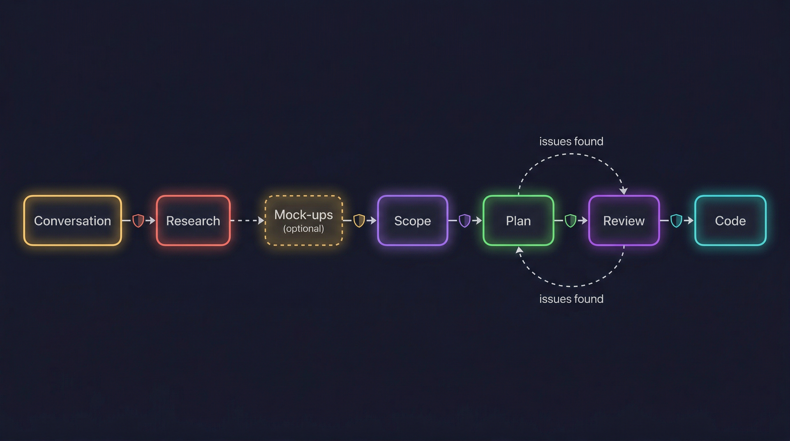
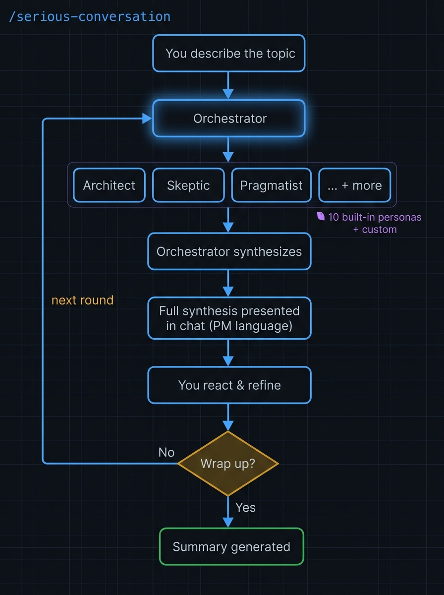
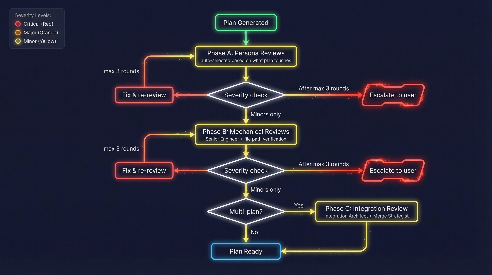
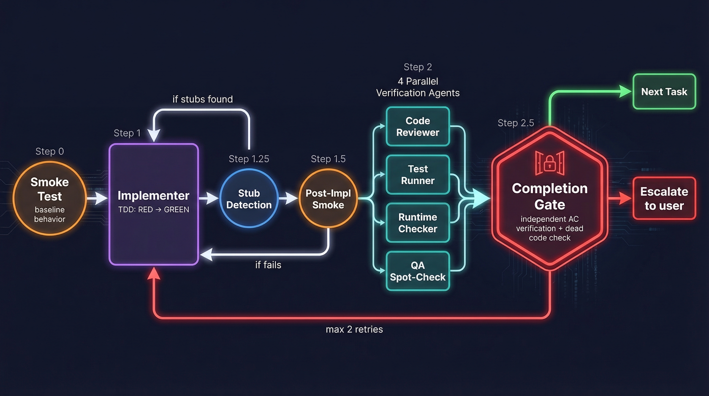
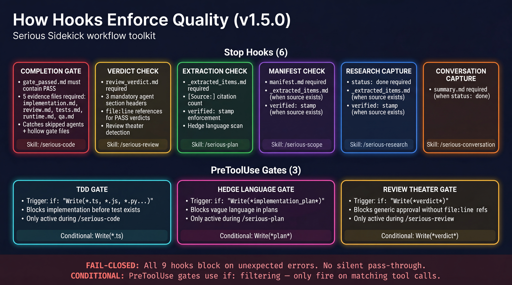
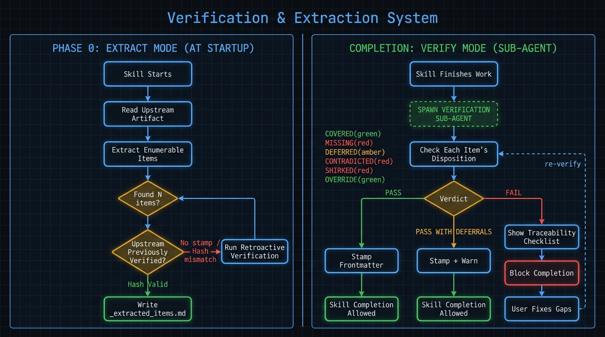

<div align="center">

# Serious Sidekick

**Your AI says "done." It isn't.**

Shell-level gates for Claude Code — deterministic checks the AI can't reason around, skip, or hallucinate through. You stop re-doing AI work. You ship with evidence, not hope.

[](CHANGELOG.md)
[](LICENSE)
[](https://docs.anthropic.com/en/docs/claude-code/overview)

[Landing Page](https://antoinedubuc.github.io/serious-sidekick/) · [Changelog](CHANGELOG.md) · [Report an Issue](https://github.com/AntoineDubuc/serious-sidekick/issues)

</div>

---

## Quick Start

**New machine? One line:**

```bash
curl -fsSL https://raw.githubusercontent.com/AntoineDubuc/serious-sidekick/main/install.sh | bash
```

This clones the repo, symlinks `serious-update` to your PATH, sets up a daily staleness check, and previews what will be installed. Then open Claude Code in your project and run:

```
/serious-init
```

That's it. You get 12 slash commands, 7 enforcement hooks, 8 specialized agents, and templates for plans, research, and scope manifests.

**Already installed? Stay current:**

```bash
serious-update
```

**Prerequisites:** [Claude Code CLI](https://docs.anthropic.com/en/docs/claude-code/overview) and a Claude account (Pro, Max, Team, or Enterprise).

---

## The Problem

You tell an AI to build something. It says "done." You check — half the requirements are missing, three are marked "future enhancement," and one is contradicted by the implementation.

**Every toolkit that tells the AI to check itself has this problem.** Prompt-based verification lives inside the AI's reasoning loop. It can be rationalized, skipped, or hallucinated.

Serious Sidekick fixes this. Not with better prompts — with shell-level enforcement.

---

## How It's Different

Most Claude Code toolkits verify with prompts. **We verify with bash.**

That's not a style choice — it's a structural one. Prompts live inside the AI's reasoning loop. Bash lives outside it. One can be rationalized. The other can't.

### Deterministic enforcement

Shell hooks run outside the AI's process. The AI cannot disable, skip, or override them.

```json
{
  "hooks": {
    "PreToolUse": [{
      "matcher": "Write",
      "hooks": [{
        "type": "command",
        "if": "Write(*gate_passed*)",
        "command": "verify-completion-gate.sh"
      }]
    }]
  }
}
```

The AI says it's done. A 50-line bash script checks if `gate_passed.md` exists. It doesn't. Session stays open. The AI can't argue — it fixes the work.

### Conditional precision

Hooks declare exactly which tool calls they care about. `Write(*verdict*)` fires the review gate. `Write(*.ts)` fires the TDD gate. `Write(*implementation_plan*)` fires the hedge language check. No wasted process spawning. No false positives.

### Fail-closed

If a hook hits an unexpected error, it blocks instead of silently passing. No silent failures. No false confidence.

---

## The Pipeline

Seven core pipeline steps, plus an optional ingestion step. Each produces artifacts that feed the next. A verifier checks every handoff — nothing gets dropped between stages.

<div align="center">
  
</div>

| Step | Command | What it does |
|:-----|:--------|:-------------|
| 0.5 | `/serious-youtube-tldr` | Ingest YouTube videos via transcripts — structured summaries and cross-video synthesis |
| 1 | `/serious-conversation` | Structured ideation with a panel of AI personas (10 built-in, custom supported) |
| 2 | `/serious-research` | Investigation with evidence grading — quick mode or deep parallel analysis |
| 3 | `/serious-mock-ups` | UI wireframes and visuals before planning (3 fidelity levels) |
| 4 | `/serious-scope` | Splits research into discrete, independently-plannable units |
| 5 | `/serious-plan` | Implementation plan with TDD protocol, acceptance criteria, and anti-rationalization rules |
| 6 | `/serious-review` | Adversarial plan review — 3 mandatory agents read the plan cold |
| 7 | `/serious-code` | Execution with 5 verification agents, TDD enforcement, and completion gates |

**Research feeds plans.** Findings become constraints. Nothing is invented mid-implementation.

**Plans feed code.** TDD sequences are defined before a single line is written. Anti-rationalization tables tell the AI what it's NOT allowed to skip.

**Hooks verify every handoff.** A shell script checks that the plan references the research. That the code matches the plan. That the tests ran before the implementation. That the gate file exists before the session closes.

### How conversations drive the pipeline

<div align="center">
  
</div>

10 built-in personas — Architect, Skeptic, Pragmatist, Product Thinker, Debugger, Security Mind, DX Advocate, Mentor, Optimizer, Historian. Each responds independently, then an Orchestrator synthesizes. You steer.

### How plans get reviewed

<div align="center">
  
</div>

3 mandatory agents read the plan cold — no research context, no author notes. 10 anti-slop checks catch vagueness, phantom architecture, and scope creep. Circuit breaker: 2 rounds max, then escalate.

### How code gets executed

<div align="center">
  
</div>

5 independent agents per task. TDD enforced — failing tests first, then implementation. Anti-rationalization tables prevent shortcuts. Non-implementer agents are mechanically blocked from editing code. The completion gate blocks the session until every evidence file exists.

---

## What You Get

### 12 Workflow Commands

| Command | Purpose |
|:--------|:--------|
| `/serious-youtube-tldr` | Video ingestion — transcripts, summaries, batch synthesis |
| `/serious-conversation` | Persona panel for ideation and exploration |
| `/serious-research` | Structured investigation with evidence |
| `/serious-mock-ups` | UI wireframes and visuals before planning |
| `/serious-scope` | Scope manifest — splits research into plan boundaries |
| `/serious-plan` | Implementation plan with TDD protocol |
| `/serious-review` | Plan quality gate — 3 mandatory agents, 10 anti-slop checks |
| `/serious-code` | Plan execution with 5 verification agents |
| `/serious-debug` | Systematic debugging — 3 modes, reproducer-driven feedback |
| `/serious-init` | Scaffold a new project with the toolkit |
| `/serious-status` | View active and completed workflows |
| `/serious-abandon` | Abandon a sub-workflow and restore parent context |

### 7 Enforcement Hooks

| Hook | Skill | What it blocks |
|:-----|:------|:---------------|
| YouTube Progress | `/serious-youtube-tldr` | Saves notebook progress on session end — ensures work survives context compaction |
| Completion Gate | `/serious-code` | Missing `gate_passed.md`, missing agent evidence files, FAIL verdicts |
| Extraction Check | `/serious-plan` | Missing upstream extraction, zero source citations, hedge language |
| Manifest Check | `/serious-scope` | Missing manifest, missing verification stamps |
| Verdict Check | `/serious-review` | Missing verdict, review theater (PASS with no specifics), missing agent reports |
| Conversation Capture | `/serious-conversation` | Status "done" without summary |
| Research Capture | `/serious-research` | Active research abandoned without completion |

All hooks use a **fail-closed pattern** — unexpected errors block instead of silently passing. All are **worktree-safe** — they resolve paths via `$CLAUDE_PROJECT_DIR` and validate against path traversal.

<div align="center">
  
</div>

### 3 PreToolUse Gates

| Gate | Trigger | What it catches |
|:-----|:--------|:----------------|
| TDD Gate | `Write(*.ts)` | Implementation files written before their tests exist |
| Hedge Language Gate | `Write(*implementation_plan*)` | Vague language in plans ("consider whether", "as appropriate") |
| Review Theater Gate | `Write(*verdict*)` | Generic approval without specific file:line references |

### 8 Specialized Agents

**Code agents** (5): Implementer, Code Reviewer, Test Runner, Runtime Checker, QA — each with anti-rationalization tables and anti-sycophancy rules. Non-implementer agents are mechanically blocked from `Edit`/`Write` via `disallowedTools`.

**Review agents** (3): Anti-Slop Auditor (10 checks), Structural Reviewer, Security Mind — all read the plan cold with no research context.

### 18 Auto-Loading Knowledge Skills

Context-aware documentation for hooks, MCP, subagents, worktrees, permissions, plugins, and 12 more Claude Code features. Loads only when the topic comes up — zero context cost when you don't need it.

---

## How Verification Works

The handoff verifier runs automatically at every pipeline stage — no commands, no flags, no opt-in.

<div align="center">
  
</div>

Each upstream item gets classified:

| Disposition | Meaning |
|:------------|:--------|
| **Covered** | Substantive treatment — own section, acceptance criteria, design decisions |
| **Deferred** | Explicitly marked with reason — passes with warning |
| **Shirked** | Mentioned but waved away — "future enhancement," hollow sections |
| **Missing** | Not mentioned at all |
| **Contradicted** | Downstream says the opposite of upstream |

Shirked, Missing, and Contradicted items **block the pipeline**. The AI must fix them before moving on.

---

## Staying Current

Other toolkits are snapshots. You clone, you init, and from that moment you're frozen in time. Every improvement stays in the template repo while your projects drift.

Serious Sidekick is a living system. One command updates everything — skills, agents, hooks, settings.json — across all your projects without touching your custom config.

```
$ serious-update
Serious Sidekick updated to 7f19830 (was f14d40a)
  ~/.claude/        6 updated, 2 new, 12 current
  ~/.claude-work/   6 updated, 2 new, 12 current
  ~/.claude-alex/   6 updated, 2 new, 12 current
  Audit log: ~/.serious-sidekick/update.log
```

**How it works:**

- A **manifest** tracks every distributable file with ownership tiers and content hashes
- **Template-owned** files (skills, agents, hooks) get overwritten — you never edit these
- **Merge-owned** files (settings.json) get a composite-key merge — your custom hooks survive, serious hooks get updated
- **User-owned** files (CLAUDE.md) are never touched after first install
- A **daily check** tells you when you're behind — no network call in your session, just a cached flag
- An **audit log** records every update with commit SHAs and file counts

| Command | What it does |
|:--------|:-------------|
| `serious-update` | Pull latest, update all global dirs, merge settings, log it |
| `serious-update --check` | Check for updates without applying (runs daily via cron) |
| `serious-update --diff` | Preview what would change |
| `serious-update --rollback` | Revert to the previous version |

Your hooks get stronger. Your agents get smarter. Your projects stay in sync. You never think about it.

---

## Init Variants

```
/serious-init                   # Everything — skills, agents, docs, CLAUDE.md
/serious-init --skills-only     # Just skills and agents, no docs
/serious-init --docs-only       # Just docs + CLAUDE.md
/serious-init --no-claude-md    # Skip CLAUDE.md if you already have one
/serious-init --no-global       # Skip global directory updates
/serious-init --dry-run         # Preview what would be installed
```

---

<div align="center">

*Built by a TPM who got tired of cleaning up after AI.*

*Most Claude Code toolkits verify with prompts. This one verifies with bash.*

[Get Started](#quick-start) · [Changelog](CHANGELOG.md) · [Report an Issue](https://github.com/AntoineDubuc/serious-sidekick/issues)

</div>
