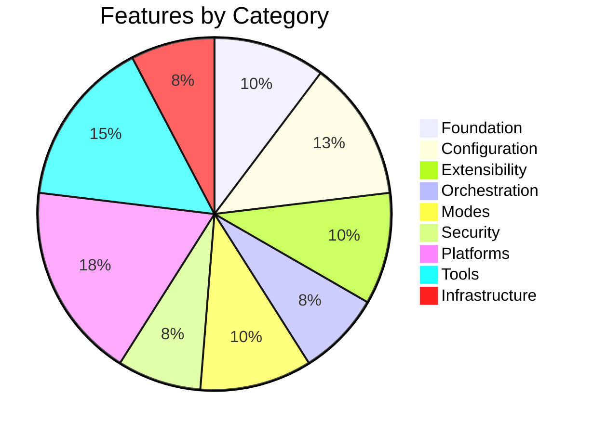

<div align="center">

# Serious Sidekick

**A workflow toolkit for Claude Code that thinks before it builds.**

Structured conversations, research with evidence grading, implementation plans with TDD,<br>
and shell hooks that physically block the AI from exiting until verification passes.

[](CHANGELOG.md)
[](#the-pipeline)
[](#how-the-system-checks-itself)

</div>

---

## The Problem

You tell an AI to build something. It says "done." You check — half the requirements are missing, three items are marked "future enhancement," and one is contradicted by the implementation. You loop back. It fixes two, introduces a new gap, and defers another.

**Serious Sidekick makes this loop unnecessary.** It structures the entire journey from idea to implementation. At every handoff, an independent verifier checks that nothing was dropped. And shell hooks running outside Claude's process **physically block the session from ending** until verification passes — the AI cannot say "done" and walk away.

---

## How It Works

The toolkit is a pipeline. Each stage produces artifacts that feed the next, and **automatic verification at every handoff ensures nothing gets lost.**


**Drift is caught where it happens, not at the end.** Every 🛡️ is an independent verifier that fires before the downstream skill finishes. If research drops a conversation insight, it gets caught before the plan ever starts — not after code is written.

<br>

<table>
<tr>
<td width="50%" valign="top">

---

## The Pipeline

### 💬 `/serious-conversation` — Think Before You Build

A structured conversation with a panel of AI personas. Each persona brings a different perspective — the Architect thinks about systems, the Skeptic pokes holes, the Pragmatist pushes for simplicity.


- **10 built-in personas** — Architect, Skeptic, Pragmatist, Product Thinker, Debugger, Security Mind, DX Advocate, Mentor, Optimizer, Historian
- **Create custom personas** from a description or by cloning an existing one
- **Full synthesis presented in the chat** in plain PM language — you don't need to read the markdown files
- **Structured questions** — when the Orchestrator needs input, you get: context, recommended option, alternatives, trade-offs

<br>

### 🔍 `/serious-research` — Investigate With Evidence

Two modes. Quick mode for focused questions. Deep mode for multi-dimensional analysis.

<table>
<tr>
<td width="50%">

Before any research begins, mandatory pre-steps capture a smoke test baseline, trace the execution path, identify caching layers, and map downstream consumers.

<br>

### 🎨 `/serious-mock-ups` — Visualize Before Planning

Three fidelity levels — wireframe (ASCII), visual (Gemini-generated), and interactive flow maps. Component inventory and design decisions feed directly into the plan.

<br>

### 📋 `/serious-plan` — Plan With Verification Built In

Generates implementation plans using the v6 template. Not a to-do list — a contract with testable acceptance criteria, TDD protocol, and independent review.

``

- **3 mandatory review agents** — Anti-Slop Auditor (10 checks), Structural Reviewer, Security Mind. All read the plan cold — no research context, no author notes
- **10 anti-slop checks** — weasel words, missing outputs, test gaps, copy-paste echo, scope creep, phantom architecture, unspecified error contracts, magic numbers, implicit ordering, dead-end tasks
- **Circuit breaker** — 2 rounds max. FAIL = fix and re-review. After 2 failures, escalate to user
- **Every acceptance criterion** must be testable and encodable as a test (TDD)

<br>

### ⚡ `/serious-code` — Execute With 5 Independent Agents

Each task goes through a cycle with 5 independent agents. No self-grading. The agents are hardened against the same LLM failure modes they're meant to catch — inspired by techniques from [obra/superpowers](https://github.com/obra/superpowers).


- **TDD enforced** — every acceptance criterion gets a failing test FIRST, then implementation
- **Two-stage code review** — Stage 1: spec compliance (COMPLIANT / PARTIAL / MISSING / WRONG per criterion — any MISSING or WRONG = automatic FAIL regardless of code quality). Stage 2: code quality, security, consistency
- **Anti-rationalization tables** — each agent has a table of excuses it might generate to skip its own protocol, with explanations of why each is wrong. Implementer: 8 TDD-skipping rationalizations. Reviewer: 7 review-softening rationalizations. QA: 6 spot-check shortcuts
- **Anti-sycophancy** — Reviewer and QA agents are forbidden from performative praise ("Great work!", "Nice implementation!"). Both verify independently against the codebase, not the implementer's self-report
- **Completion Gate** — an independent agent verifies every criterion has implementing code AND that the code is reachable (catches dead code). A stop hook enforces this — the session can't exit without it.
- **Stub detection** — scans for `TODO`, `throw UnimplementedException`, and other placeholder patterns after implementation
- **Multi-plan execution** via git worktrees for parallel isolation
- **Inter-plan regression checking** — after merging parallel plans, re-verifies all previous phases

<br>

### ✅ `/serious-review` — Close the Loop

Structured defect capture that funnels findings back into the pipeline. Issues get IDs, classifications, and severity ratings, then cycle back through research → plan → code.

---

## Quick Start

### Install into any project

Open Claude Code in your project and run:

```
/serious-init
```

This copies everything — skills, agents, feature docs, plan template, and CLAUDE.md config.

**Variants:**

```
/serious-init --skills-only     # Just skills, no docs
/serious-init --docs-only       # Just docs + CLAUDE.md
/serious-init --no-claude-md    # Skip CLAUDE.md if you have one
```

### Prerequisites

- [Claude Code](https://docs.anthropic.com/en/docs/claude-code/overview) (`npm install -g @anthropic-ai/claude-code`)
- A Claude account (Pro, Max, Team, or Enterprise)
- For `/serious-init`: the global skill at `~/.claude/skills/serious-init/SKILL.md`

---

## Skills

<table>
<tr>
<th>Workflow Skills (8)</th>
<th>What They Do</th>
</tr>
<tr><td><code>/serious-conversation</code></td><td>Persona panel for ideation and exploration</td></tr>
<tr><td><code>/serious-research</code></td><td>Structured investigation with evidence</td></tr>
<tr><td><code>/serious-mock-ups</code></td><td>UI wireframes and visuals before planning</td></tr>
<tr><td><code>/serious-scope</code></td><td>Scope manifest — splits research into plan boundaries</td></tr>
<tr><td><code>/serious-plan</code></td><td>Single-plan generation with TDD protocol</td></tr>
<tr><td><code>/serious-review</code></td><td>Plan quality gate — 3 mandatory agents, cold-read, 10 anti-slop checks</td></tr>
<tr><td><code>/serious-code</code></td><td>Plan execution with 5 verification agents</td></tr>
<tr><td><code>/serious-bananas</code></td><td>Image/diagram generation via Gemini API (Nano Banana 2 — 4K, dark mode, 3 model tiers)</td></tr>
<tr><td><code>/serious-init</code></td><td>Scaffold a new project with the toolkit</td></tr>
</table>

<table>
<tr>
<th>Auto-Loading Skills (20)</th>
<th>Loads When You Discuss...</th>
</tr>
<tr><td><code>hooks</code></td><td>Lifecycle events, automation, policy enforcement</td></tr>
<tr><td><code>skills-and-commands</code></td><td>Creating custom slash commands</td></tr>
<tr><td><code>mcp-integration</code></td><td>MCP servers, external tools, databases</td></tr>
<tr><td><code>subagents</code></td><td>Multi-agent workflows, parallel agents</td></tr>
<tr><td><code>agent-teams</code></td><td>Agent swarms, multi-agent collaboration</td></tr>
<tr><td><code>permissions</code></td><td>Allow/deny rules, sandboxing</td></tr>
<tr><td><code>plan-mode</code></td><td>Read-only exploration, safe analysis</td></tr>
<tr><td><code>worktrees</code></td><td>Parallel branches, isolated development</td></tr>
<tr><td><code>headless-mode</code></td><td>Scripting, CI/CD, the -p flag</td></tr>
<tr><td><code>plugins</code></td><td>Plugin creation and distribution</td></tr>
<tr><td><code>chrome-integration</code></td><td>Browser automation, debugging</td></tr>
<tr><td><code>fast-mode</code></td><td>Speed toggle, faster responses</td></tr>
<tr><td><code>checkpointing</code></td><td>Rewind, undo, restoring code</td></tr>
<tr><td><code>remote-control</code></td><td>Mobile access, session teleporting</td></tr>
<tr><td><code>keybindings</code></td><td>Keyboard shortcuts, chord bindings</td></tr>
<tr><td><code>output-styles</code></td><td>Response format, learning mode</td></tr>
<tr><td><code>status-line</code></td><td>Status bar customization</td></tr>
<tr><td><code>scheduled-tasks</code></td><td>Cron scheduling, recurring prompts</td></tr>
<tr><td><code>serious-status</code></td><td>View active and completed workflows</td></tr>
<tr><td><code>serious-abandon</code></td><td>Abandon a sub-workflow, restore parent context</td></tr>
</table>

---

## Claude Code Knowledge Base

39 documented features across 9 categories — each with a research file containing capabilities, configuration, usage examples, gotchas, and source URLs.



The knowledge loads in three layers, each serving a different purpose:

| Layer                   | What                          | When                    | Context Cost              |
| :---------------------- | :---------------------------- | :---------------------- | :------------------------ |
| **CLAUDE.md**     | Feature index + rules         | Every session           | Minimal — always present |
| **Skills**        | How-to cheat sheets           | When the topic comes up | Only when relevant        |
| **Research docs** | Deep reference with citations | When explicitly needed  | Only when read            |

This means Claude always *knows* what it can do (CLAUDE.md), gets the right syntax when it needs it (skills), and can go deep on edge cases (research docs) — without bloating every session with documentation it doesn't need.

---

## How Verification Works

The handoff verifier is the system's immune system. It runs automatically — no commands, no flags, no opt-in.


**Six dispositions** — each item gets classified:

|      | Disposition            | What It Means                                                                 |
| :--- | :--------------------- | :---------------------------------------------------------------------------- |
| ✅   | **Covered**      | Substantive treatment — own section, acceptance criteria, design decisions   |
| ⚠️ | **Deferred**     | Explicitly marked `[DEFERRED: reason]` — passes with warning               |
| 🚫   | **Shirked**      | Mentioned but waved away — "future enhancement," hollow sections, LLM dodges |
| ❌   | **Missing**      | Not mentioned at all                                                          |
| 🔀   | **Contradicted** | Downstream says the opposite of upstream                                      |
| ✅   | **Override**     | User asserts it's handled with `[VERIFIED: override — reason]`             |

---

## How the System Checks Itself

Six shell scripts fire automatically when a Claude session ends — one for each workflow skill. They catch incomplete work before it's forgotten.

| Hook | Skill | What it catches |
|:-----|:------|:----------------|
| **Completion Gate** | `/serious-code` | Blocks exit if any task evidence directory is missing `gate_passed.md`. The AI cannot skip verification. |
| **Extraction Check** | `/serious-plan` | Warns if a plan was generated from research but `_extracted_items.md` is missing. The extraction gate was skipped — the plan will have gaps. |
| **Manifest Check** | `/serious-scope` | Warns if scoping started but no `manifest.md` was produced. |
| **Verdict Check** | `/serious-review` | Warns if plan review started but no `review_verdict.md` exists. The quality gate never reached a decision. |
| **Conversation Capture** | `/serious-conversation` | Warns if no `summary.md` exists. Insights won't survive to the next session. |
| **Research Capture** | `/serious-research` | Warns if research is still `status: active`. Incomplete findings won't be picked up by planning. |

These are registered in `.claude/settings.json` and installed by `/serious-init`. The AI cannot bypass them — they're enforced by the Claude Code runtime, not by prompts.

---

<div align="center">

### Built with Claude Code. Verified by Claude Code. Kept honest by Claude Code.

[Changelog](CHANGELOG.md) · [Getting Started](#quick-start) · [Report an Issue](https://github.com/AntoineDubuc/serious-sidekick/issues)

</div>
