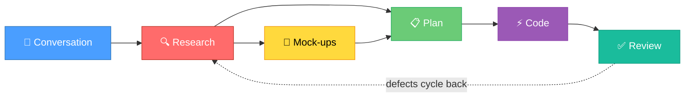
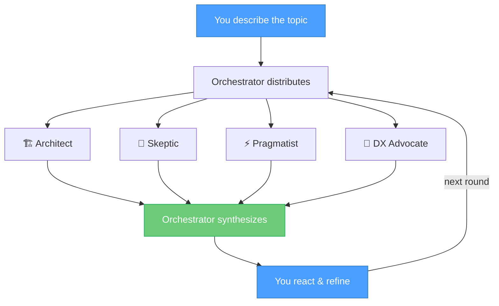
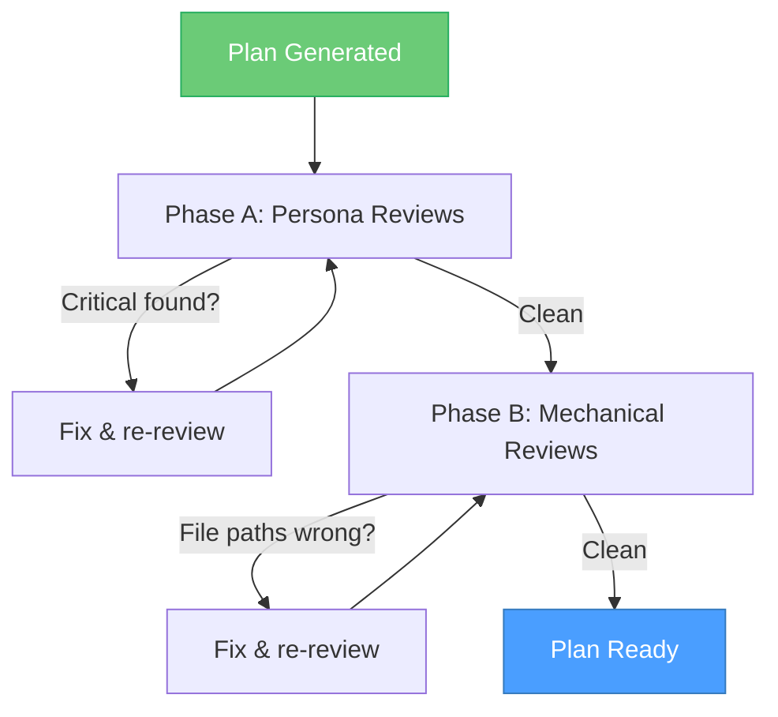
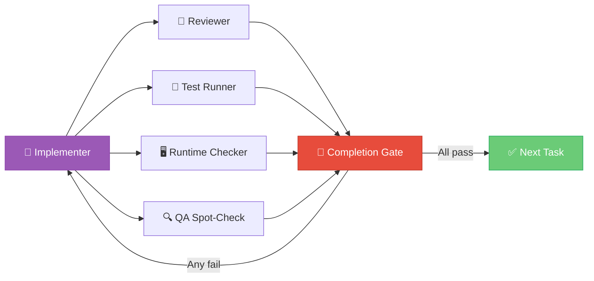
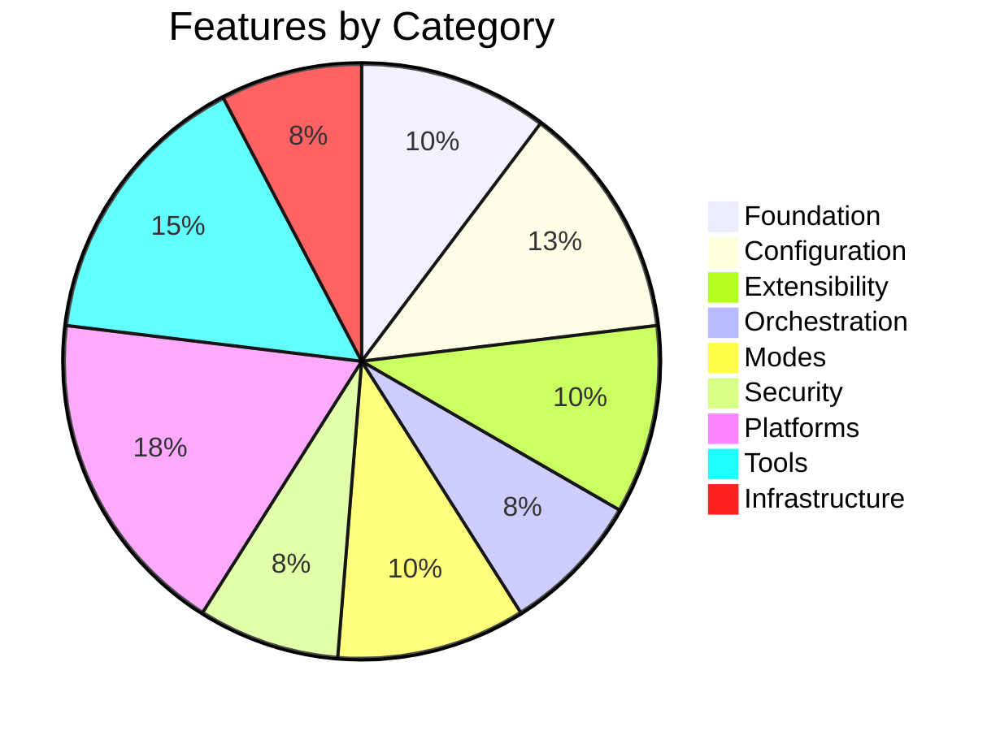
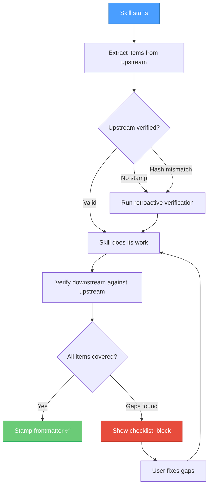

<div align="center">

# Serious Sidekick

**A workflow toolkit for Claude Code that thinks before it builds.**

Structured conversations, research with evidence grading, implementation plans with TDD,<br>
and automatic verification that catches when the AI drops, defers, or half-does your work.

[](CHANGELOG.md)
[](#skills)
[](#claude-code-knowledge-base)

</div>

---

## The Problem

You tell an AI to build something. It says "done." You check — half the requirements are missing, three items are marked "future enhancement," and one is contradicted by the implementation. You loop back. It fixes two, introduces a new gap, and defers another.

**Serious Sidekick makes this loop unnecessary.** It structures the entire journey from idea to implementation, and at every step, an independent verifier checks that nothing was dropped, deferred, or half-done.

---

## How It Works

The toolkit is a pipeline. Each stage produces artifacts that feed the next, and **automatic verification at every handoff ensures nothing gets lost.**



<br>

<table>
<tr>
<td width="50%" valign="top">

### 🛡️ What Catches the Drift

At every arrow in that diagram, an independent verifier:

1. **Extracts** every item from the upstream artifact
2. **Checks** whether the downstream output addresses each one
3. **Classifies** each as covered, missing, shirked, contradicted, deferred, or overridden
4. **Blocks** if anything was dropped or waved away

The verifier catches 11 patterns of scope shirking — including LLM-specific ones like "this should be handled by a configurable policy layer" (sounds smart, does nothing).

</td>
<td width="50%" valign="top">

### 📊 Verification Output

```
Source: research.md (8 findings)

1. Token rotation    → ✅ Covered
2. Session mgmt      → ✅ Covered
3. Refresh tokens    → ⚠️ Deferred
4. Rate limiting     → 🚫 Shirked
5. Key storage       → ✅ Covered
6. Audit logging     → ❌ Missing
7. Token lifetime    → ✅ Covered
8. Revocation        → ✅ Override

Verdict: FAIL — 1 shirked, 1 missing
```

</td>
</tr>
</table>

---

## The Pipeline

### 💬 `/serious-conversation` — Think Before You Build

A structured conversation with a panel of AI personas. Each persona brings a different perspective — the Architect thinks about systems, the Skeptic pokes holes, the Pragmatist pushes for simplicity.



- **10 built-in personas** — Architect, Skeptic, Pragmatist, Product Thinker, Debugger, Security Mind, DX Advocate, Mentor, Optimizer, Historian
- **Create custom personas** from a description or by cloning an existing one
- **Full synthesis presented in the chat** in plain PM language — you don't need to read the markdown files
- **Structured questions** — when the Orchestrator needs input, you get: context, recommended option, alternatives, trade-offs

<br>

### 🔍 `/serious-research` — Investigate With Evidence

Two modes. Quick mode for focused questions. Deep mode for multi-dimensional analysis.

<table>
<tr>
<td width="50%">

**Quick Mode**
- Single-threaded investigation
- Persona reviews (Senior Engineer, Security, etc.)
- Markdown deliverable

*Best for: bug diagnosis, focused questions, single-angle investigations*

</td>
<td width="50%">

**Deep Mode**
- Parallel research agents
- Evidence grading (A through F)
- Adversarial verification (tries to disprove your findings)
- QA citation checking
- Self-contained HTML report

*Best for: architecture decisions, competitive analysis, high-stakes choices*

</td>
</tr>
</table>

Before any research begins, mandatory pre-steps capture a smoke test baseline, trace the execution path, identify caching layers, and map downstream consumers.

<br>

### 🎨 `/serious-mock-ups` — Visualize Before Planning

Three fidelity levels — wireframe (ASCII), visual (Gemini-generated), and interactive flow maps. Component inventory and design decisions feed directly into the plan.

<br>

### 📋 `/serious-plan` — Plan With Verification Built In

Generates implementation plans using the v6 template. Not a to-do list — a contract with testable acceptance criteria, TDD protocol, and independent review.



- **Adaptive persona pipeline** — selects reviewers based on what the plan touches (UI → End User, auth → Security Reviewer, async → Concurrency Engineer)
- **Severity-weighted convergence** — any Critical finding forces re-review, max 3 rounds
- **Every acceptance criterion** must be testable and encodable as a test (TDD)
- **Single or multiple plans** with a phase map for parallel execution

<br>

### ⚡ `/serious-code` — Execute With 5 Independent Agents

Each task goes through a cycle with 5 independent agents. No self-grading.



- **TDD enforced** — every acceptance criterion gets a failing test FIRST, then implementation
- **Completion Gate** — an independent agent verifies every criterion has implementing code AND that the code is reachable (catches dead code). A stop hook enforces this — the session can't exit without it.
- **Stub detection** — scans for `TODO`, `throw UnimplementedException`, and other placeholder patterns after implementation
- **Multi-plan execution** via git worktrees for parallel isolation
- **Inter-plan regression checking** — after merging parallel plans, re-verifies all previous phases

<br>

### ✅ `/serious-review` — Close the Loop

Structured defect capture that funnels findings back into the pipeline. Issues get IDs, classifications, and severity ratings, then cycle back through research → plan → code.

---

## Quick Start

### Install into any project

Open Claude Code in your project and run:

```
/serious-init
```

This copies everything — skills, agents, feature docs, plan template, and CLAUDE.md config.

**Variants:**
```
/serious-init --skills-only     # Just skills, no docs
/serious-init --docs-only       # Just docs + CLAUDE.md
/serious-init --no-claude-md    # Skip CLAUDE.md if you have one
```

### Prerequisites

- [Claude Code](https://docs.anthropic.com/en/docs/claude-code/overview) (`npm install -g @anthropic-ai/claude-code`)
- A Claude account (Pro, Max, Team, or Enterprise)
- For `/serious-init`: the global skill at `~/.claude/skills/serious-init/SKILL.md`

---

## Skills

<table>
<tr>
<th>Workflow Skills (8)</th>
<th>What They Do</th>
</tr>
<tr><td><code>/serious-conversation</code></td><td>Persona panel for ideation and exploration</td></tr>
<tr><td><code>/serious-research</code></td><td>Structured investigation with evidence</td></tr>
<tr><td><code>/serious-mock-ups</code></td><td>UI wireframes and visuals before planning</td></tr>
<tr><td><code>/serious-plan</code></td><td>Implementation planning with TDD and reviews</td></tr>
<tr><td><code>/serious-code</code></td><td>Plan execution with 5 verification agents</td></tr>
<tr><td><code>/serious-review</code></td><td>Defect capture, cycles back into pipeline</td></tr>
<tr><td><code>/serious-bananas</code></td><td>Image/diagram generation via Gemini API</td></tr>
<tr><td><code>/serious-init</code></td><td>Scaffold a new project with the toolkit</td></tr>
</table>

<table>
<tr>
<th>Auto-Loading Skills (19)</th>
<th>Loads When You Discuss...</th>
</tr>
<tr><td><code>hooks</code></td><td>Lifecycle events, automation, policy enforcement</td></tr>
<tr><td><code>skills-and-commands</code></td><td>Creating custom slash commands</td></tr>
<tr><td><code>mcp-integration</code></td><td>MCP servers, external tools, databases</td></tr>
<tr><td><code>subagents</code></td><td>Multi-agent workflows, parallel agents</td></tr>
<tr><td><code>agent-teams</code></td><td>Agent swarms, multi-agent collaboration</td></tr>
<tr><td><code>permissions</code></td><td>Allow/deny rules, sandboxing</td></tr>
<tr><td><code>plan-mode</code></td><td>Read-only exploration, safe analysis</td></tr>
<tr><td><code>worktrees</code></td><td>Parallel branches, isolated development</td></tr>
<tr><td><code>headless-mode</code></td><td>Scripting, CI/CD, the -p flag</td></tr>
<tr><td><code>plugins</code></td><td>Plugin creation and distribution</td></tr>
<tr><td><code>chrome-integration</code></td><td>Browser automation, debugging</td></tr>
<tr><td><code>fast-mode</code></td><td>Speed toggle, faster responses</td></tr>
<tr><td><code>checkpointing</code></td><td>Rewind, undo, restoring code</td></tr>
<tr><td><code>remote-control</code></td><td>Mobile access, session teleporting</td></tr>
<tr><td><code>keybindings</code></td><td>Keyboard shortcuts, chord bindings</td></tr>
<tr><td><code>output-styles</code></td><td>Response format, learning mode</td></tr>
<tr><td><code>status-line</code></td><td>Status bar customization</td></tr>
<tr><td><code>scheduled-tasks</code></td><td>Cron scheduling, recurring prompts</td></tr>
<tr><td><code>serious-status</code></td><td>View active and completed workflows</td></tr>
</table>

---

## Claude Code Knowledge Base

39 documented features across 9 categories — each with a research file containing capabilities, configuration, usage examples, gotchas, and source URLs.



The knowledge loads in three layers, each serving a different purpose:

| Layer | What | When | Context Cost |
|:------|:-----|:-----|:-------------|
| **CLAUDE.md** | Feature index + rules | Every session | Minimal — always present |
| **Skills** | How-to cheat sheets | When the topic comes up | Only when relevant |
| **Research docs** | Deep reference with citations | When explicitly needed | Only when read |

This means Claude always *knows* what it can do (CLAUDE.md), gets the right syntax when it needs it (skills), and can go deep on edge cases (research docs) — without bloating every session with documentation it doesn't need.

---

## How Verification Works

The handoff verifier is the system's immune system. It runs automatically — no commands, no flags, no opt-in.



**Six dispositions** — each item gets classified:

| | Disposition | What It Means |
|:--|:-----------|:--------------|
| ✅ | **Covered** | Substantive treatment — own section, acceptance criteria, design decisions |
| ⚠️ | **Deferred** | Explicitly marked `[DEFERRED: reason]` — passes with warning |
| 🚫 | **Shirked** | Mentioned but waved away — "future enhancement," hollow sections, LLM dodges |
| ❌ | **Missing** | Not mentioned at all |
| 🔀 | **Contradicted** | Downstream says the opposite of upstream |
| ✅ | **Override** | User asserts it's handled with `[VERIFIED: override — reason]` |

---

<div align="center">

### Built with Claude Code. Verified by Claude Code. Kept honest by Claude Code.

[Changelog](CHANGELOG.md) · [Getting Started](#quick-start) · [Report an Issue](https://github.com/AntoineDubuc/serious-sidekick/issues)

</div>
